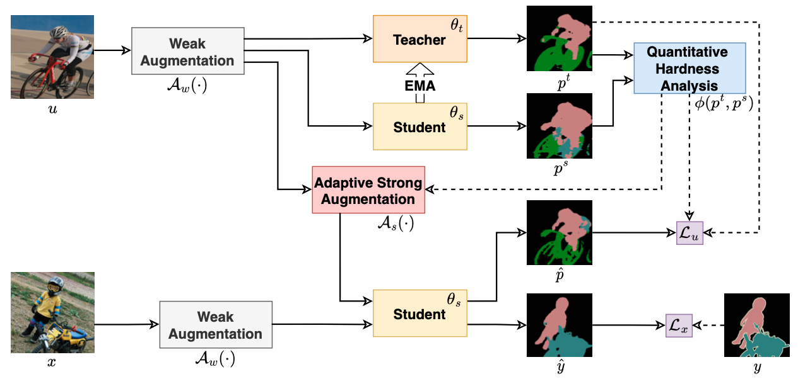

# iMAS

> "Instance-specific and Model-adaptive Supervision for Semi-supervised Semantic Segmentation".


### Introduction

- Recently, semi-supervised semantic segmentation has achieved promising performance with a small fraction of labeled data. However, most existing studies treat all unlabeled data equally and barely consider the differences and training difficulties among unlabeled instances. Differentiating unlabeled instances can promote instance-specific supervision to adapt to the model's evolution dynamically.
  In this paper, we emphasize the cruciality of instance differences and propose an instance-specific and model-adaptive supervision for semi-supervised semantic segmentation, named iMAS.
- Relying on the model's performance, iMAS employs a class-weighted symmetric intersection-over-union to evaluate quantitative hardness of each unlabeled instance and supervises the training on unlabeled data in a model-adaptive manner. Specifically, iMAS learns from unlabeled instances progressively by weighing their corresponding consistency losses based on the evaluated hardness. Besides, iMAS dynamically adjusts the augmentation for each instance such that the distortion degree of augmented instances is adapted to the model's generalization capability across the training course.
- Not integrating additional losses and training procedures, iMAS can obtain remarkable performance gains against current state-of-the-art approaches on segmentation benchmarks under different semi-supervised partition protocols.


### Diagram



> In a teacher-student framework, labeled data $(x,y)$ is used to train the student model, parameterized by $\theta_s$, by minimizing the supervised loss $\mathcal{L}_x$. Unlabeled data $u$, weakly augmented by $\mathcal{A}_w(\cdot)$, is first fed into both the student and teacher models to obtain predictions $p^s$ and $p^t$, respectively. Then we perform quantitative hardness evaluation on each unlabeled instance by strategy $\phi(p^t, p^s)$. Such hardness information can be subsequently utilized: 1) to apply an adaptive augmentation, denoted by $\mathcal{A}_s(\cdot)$, on unlabeled data to obtain the student model's prediction $\hat{p}$; 2) to weigh the unsupervised loss $\mathcal{L}_u$  in a instance-specific manner. The teacher model's weight, $\theta_t$, is updated by the exponential moving average (EMA) of $\theta_s$ across the training course.


### Performance

Comparison with SOTA methods on PASCAL VOC 2012 val set under different partition protocols

|       ResNet-50       |   1/16   |   1/8    |   1/4    |      ResNet-101       |   1/16   |   1/8    |   1/4    |
| :-------------------: | :------: | :------: | :------: | :-------------------: | :------: | :------: | :------: |
|        SupOnly        |   63.8   |   69.0   |   72.5   |        SupOnly        |   67.4   |   72.1   |   74.7   |
|          CPS          |   72.0   |   73.7   |   74.9   |          CPS          |   74.5   |   76.4   |   77.7   |
|         ST++          |   72.6   |   74.4   |   75.4   |         ST++          |   74.5   |   76.3   |   76.6   |
| U<sup>2</sup>PL(os=8) |   72.0   |   75.2   |   76.2   | U<sup>2</sup>PL(os=8) |   74.4   |   77.6   |   78.7   |
|    **iMAS**(os=8)     | **75.9** | **76.7** | **77.1** |    **iMAS** (os=8)    | **77.2** | **78.4** | **79.3** |


Comparison with SOTAs on Cityscapes val set under different partition protocols. Using R-50 as encoder.

| R50                      | 1/16   | 1/8     | 1/4       | 1/2 |
| :-------------------------: | :-------: | :-------: | :-------: | :-------: |
| SupOnly                     | 64.0 | 69.2 | 73.0 | 76.4 |
| CPS          | 74.4 | 76.6 | 77.8 | 78.8 |
| CPS (by U<sup>2</sup>PL) | 69.8 | 74.3  | 74.6   | 76.8 |
| ST++         | - | 72.7   | 73.8   | - |
| PS-MT             | -      | 75.8  | 76.9    | 77.6 |
| U<sup>2</sup>PL(os=8)       | 69.0 | 73.0     | 76.3     | 78.6 |
| **iMAS** (os=8) | **75.2** | **78.0** | **78.2** | **80.2** |

> All the training logs of iMAS and our reproduced SupOnly baselines are included under the directory of [training-imas-logs](./training-imas-logs)


## Running AugSeg

### Prepare datasets

Please download the Pascal and Cityscapes, and set up the path to them properly in the configuration files.

- Pascal: [JPEGImages](http://host.robots.ox.ac.uk/pascal/VOC/voc2012/VOCtrainval_11-May-2012.tar) | [SegmentationClass](https://drive.google.com/file/d/1ikrDlsai5QSf2GiSUR3f8PZUzyTubcuF/view?usp=sharing)
- Cityscapes: [leftImg8bit](https://www.cityscapes-dataset.com/file-handling/?packageID=3) | [gtFine](https://drive.google.com/file/d/1E_27g9tuHm6baBqcA7jct_jqcGA89QPm/view?usp=sharing)
- splits: included.

Here is our adopted way，

```
├── ./data
    ├── splits
      ├── cityscapes
      └── pascal
    ├── VOC2012
      ├── JPEGImages
      ├── SegmentationClass
      └── SegmentationClassAug
    └── cityscapes
      ├── gtFine
      └── leftImg8bit

```


### Prepare pre-trained encoder

Please download the pretrained models, and set up the path to these models properly in the file of `config_xxx.yaml` .

[ResNet-50](https://drive.google.com/file/d/1AuyE_rCUSwDpjMJHMPklXeKdZpdH1-6F/view?usp=sharing) | [ResNet-101](https://drive.google.com/file/d/13jNMOEYkqBC3CimlSSw-sWRHVZEeROmK/view?usp=sharing) 

Here is our adopted way，

```
├── ./pretrained
    ├── resnet50.pth
    └── resnet101.pth
```


### Prepare running Envs

Nothing special
- python: 3.7.13
- pytorch: 1.7.1
- cuda11.0.221_cudnn8.0.5_0
- torchvision:  0.8.2 


### Ready to Run

Basically, you are recommanded to config the experimental runnings in a ".yaml" file firstly. 
We include various configuration files under the directory of "exps".


```bash
# 1) configure your yaml file in a running script
vim ./single_run.sh

# 2) run directly
sh ./single_run.sh

```

## Citation

If you find these projects useful, please consider citing:

```bibtex
@inproceedings{zhen23imas,
  title={Instance-specific and Model-adaptive Supervision for Semi-supervised Semantic Segmentation},
  author={Zhao, Zhen and Long, Sifan and Pi, Jimin and Wang, Jingdong and Zhou, Luping},
  booktitle={CVPR},
  year={2023}
}
```

We have other relevant semi-supervised semantic segmentation projects:
- [ST++](https://github.com/LiheYoung/ST-PlusPlus)
- [Augseg](https://github.com/ZhenZHAO/augseg)
- [Unimatch](https://github.com/LiheYoung/UniMatch)

## Acknowledgement

We thank [ST++](https://github.com/LiheYoung/ST-PlusPlus), [CPS](https://github.com/charlesCXK/TorchSemiSeg), and [U<sup>2</sup>PL](https://github.com/Haochen-Wang409/U2PL), for part of their codes, processed datasets, data partitions, and pretrained models.
